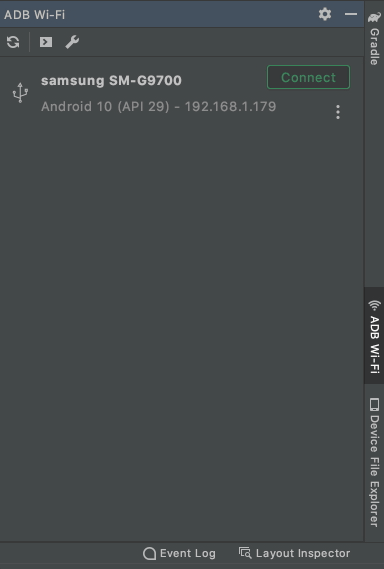

# ADB Wi-Fi

<!-- Plugin description -->
This plugin simplifies the usage of [ADB][adb]'s ["Connect over Wi-Fi"][adb#wireless] feature.

## How to Use
1. Connect an Android device via USB cable.
2. Open the "ADB Wi-Fi" Tool Window (in the right-bottom corner).
3. Click the "Connect" button.
4. After a successful connection, you can unplug the USB cable.

  
<!-- Plugin description end -->

## Installation

- Using IDE built-in plugin system:
  
  <kbd>Preferences</kbd> > <kbd>Plugins</kbd> > <kbd>Marketplace</kbd> > <kbd>Search for "ADB Wi-Fi"</kbd> >
  <kbd>Install Plugin</kbd>
  
- Manually:

  Download the [latest release](https://github.com/y-polek/ADB-Wi-Fi/releases/latest) and install it manually using
  <kbd>Preferences</kbd> > <kbd>Plugins</kbd> > <kbd>⚙️</kbd> > <kbd>Install plugin from disk...</kbd>

[adb]: https://developer.android.com/studio/command-line/adb
[adb#wireless]: https://developer.android.com/studio/command-line/adb#wireless
